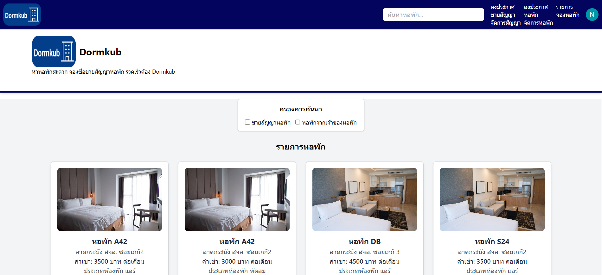
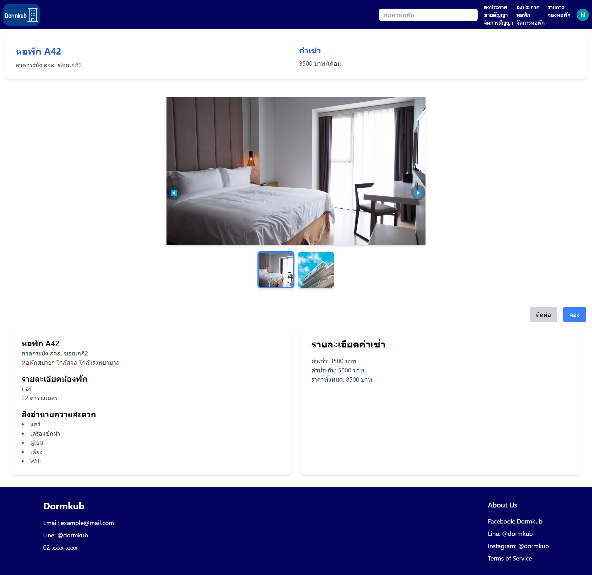
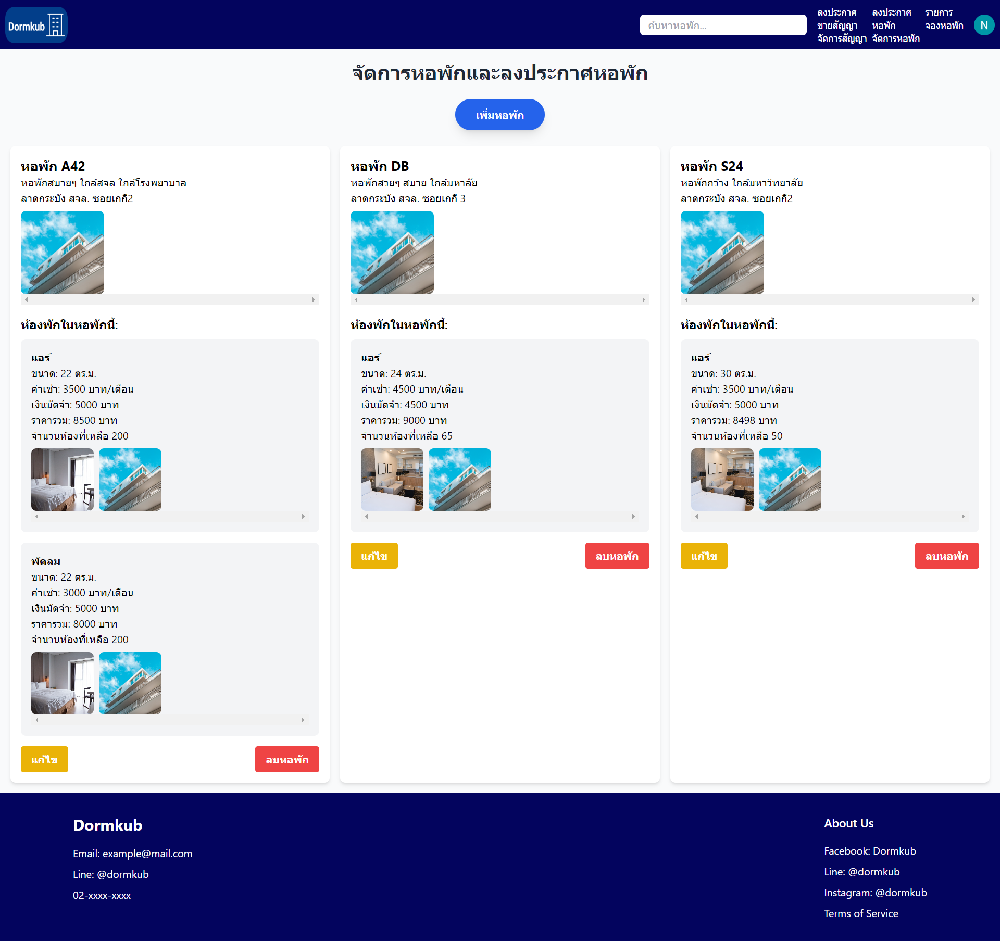
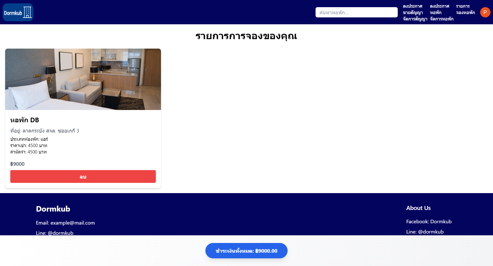
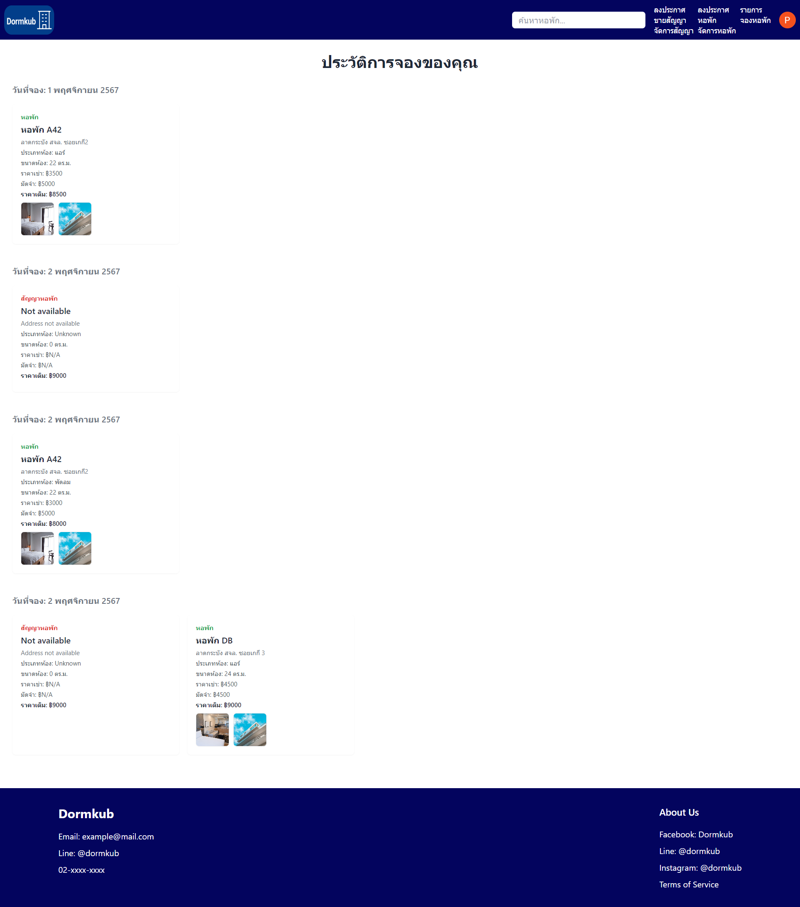

# Dormkub

Dormkub is a platform website for renting and posting dormitories and dormitory contracts for sale.

The tech stack used includes React, Express.js, and MongoDB.
Additional tools include JWT and Passport.js (for signup and login with Google),
and the website is styled with Tailwind CSS.

Here is a picture of the website:

